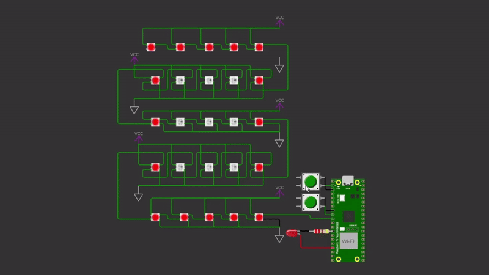

# Tarefa Interrupções



## Explicação do projeto

https://github.com/user-attachments/assets/419ee064-7afe-4f6c-a3b0-435492861f0d

## Enunciado

Para consolidar a compreensão dos conceitos relacionados ao uso de interrupções no microcontrolador RP2040 e explorar as funcionalidades da placa de desenvolvimento BitDogLab, propõe-se a seguinte tarefa prática.


## Objetivos
• Compreender o funcionamento e a aplicação de interrupções em microcontroladores.
• Identificar e corrigir o fenômeno do bouncing em botões por meio de debouncing via software.
• Manipular e controlar LEDs comuns e LEDs endereçáveis WS2812.
• Fixar o estudo do uso de resistores de pull-up internos em botões de acionamento.
• Desenvolver um projeto funcional que combine hardware e software.


## Descrição do Projeto:
Neste projeto, utilizei os seguintes componentes conectados à placa BitDogLab:
• Matriz 5x5 de LEDs (endereçáveis) WS2812, conectada à GPIO 7.
• LED RGB, com os pinos conectados às GPIOs (11, 12 e 13).
• Botão A conectado à GPIO 5.
• Botão B conectado à GPIO 6.


## Funcionalidades do Projeto
1. O LED vermelho do LED RGB deve piscar continuamente 5 vezes por segundo.
2. O botão A deve incrementar o número exibido na matriz de LEDs cada vez que for pressionado.
3. O botão B deve decrementar o número exibido na matriz de LEDs cada vez que for pressionado.
4. Os LEDs WS2812 devem ser usados para criar efeitos visuais representando números de 0 a 9.

## Requisitos do Projeto
Para o desenvolvimento, devem ser seguidos os seguintes requisitos:
1. Uso de interrupções: Todas as funcionalidades relacionadas aos botões devem ser implementadas utilizando rotinas de interrupção (IRQ).
2. Debouncing: É obrigatório implementar o tratamento do bouncing dos botões via software.
3. Controle de LEDs: O projeto deve incluir o uso de LEDs comuns e LEDs WS2812, demonstrando o domínio de diferentes tipos de controle.
4. Organização do código: O código deve estar bem estruturado e comentado para facilitar o entendimento.

## Execução do projeto

1. Clone o repositório em sua maqu:
```
git clone https://github.com/caiquedebrito/interruptions
```
2. Abra o projeto no vs code
```
code interruptions
```
3. Compile o projeto com a extensão CMake no vs code
4. Conecte sua placa BitDogLab em seu computador em modo bootsel
5. Clique no botão run da extensão CMake do VS Code para carregar o projeto na placa
